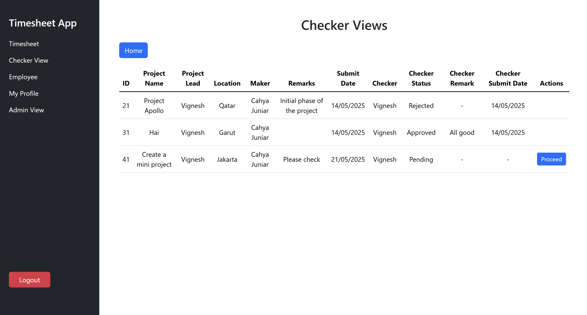

# Auth Project – Frontend

This is the **React** frontend for the `java-project-be`, built using **Vite**. It interacts with a **Spring Boot REST API** for authentication and authorization features.

---

## Setup

### 1. Clone the project

```bash
git clone https://github.com/juniarc/midas-mini-project-fe.git
cd midas-mini-project-fe-main
```

### 2. Install dependencies

```bash
npm install
```

### 3. Start the dev server

```bash
npm run dev
```

### Features

## 🔐 1. Authentication

### 🔑 Login

- Users can log in by entering their **username** and **password** that were registered previously.


### 📝 Register

- New users can sign up by providing:
  - **Name**
  - **Email**
  - **Username**
  - **Password**
- The password is securely encoded to ensure user security.


---

## 🕒 2. Timesheet View

Users can view and manage their timesheet data.

### Features:

- ➕ Create new timesheet
- ✏️ Edit timesheet
- 🗑️ Delete timesheet


### Fields in New/Edit Timesheet (User Side):

- **Project Name**: Name of the project.
- **Project Leader**: Person in charge of the project.
- **Employee**: Selectable list of available employees.
- **Location**: Project location.
- **Remarks**: Notes from the user about the timesheet.
- **Checker Name**: The employee who will receive the timesheet request (checker).


---

## 👥 3. Employee View

Displays a list of registered employees.

- Each employee entry is automatically created when a new user registers.
- Users can view employee data from this section.


---

## 🙍‍♂️ 4. My Profile

Allows users to view and edit their own employee profile.

### Editable Profile Fields:

- **Employee Name**: Full name of the user.
- **Date of Join**: The date the employee joined the company.
- **Manager**: The user's manager.
- **Employee Email**: Email address.
- **Employee Phone**: Phone number.


---

## ✅ 5. Checker View

This view is designed for checkers to manage timesheet requests assigned to them.

### Features:

- View all timesheet requests sent to the checker.
- Process each request by updating status and notes.



### Fields in Timesheet Edit (Checker Side):

- **Checker Remark**: Notes from the checker.
- **Checker Status**: The status of the request as decided by the checker.


---

## 🛡️ 6. Admin View

A special interface for administrators to monitor all timesheet activity.

- Admins can view timesheet requests submitted by every user.
- Admin accounts are currently created manually via the database.
- There are two roles:
  - `role_id: 1` - Standard User
  - `role_id: 2` - Admin


---
